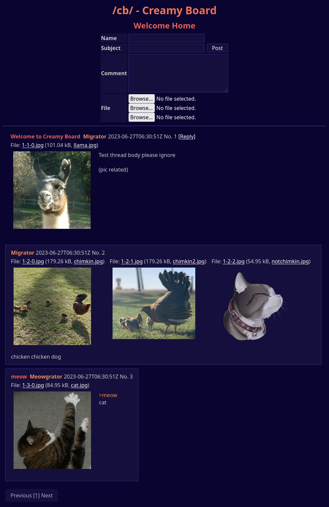

# Creamy Board

<p align="center">
    
    <p align="center">Yet Another Open Imageboard</p>
    <p align="center">
        <a href="./LICENSE"></a>
    </p>
</p>

## Screenshots



## Building

### Without Docker

```
# install generation utils and generate
go install github.com/jschaf/pggen/cmd/pggen@latest
go install github.com/a-h/templ/cmd/templ@v0.2.304
go generate ./...

go build
```

### With Docker

`docker build -t ghcr.io/albinodrought/creamy-board .`

## Usage

For an out-of-the-box compose file, see [./compose/docker-compose.yml](./compose/docker-compose.yml)

- `CREAMY_DSN`: Postgres DSN passed to pgx
- `CREAMY_STORAGE_DRIVER`: `fs` or `minio`
  - if `fs`:
    - `CREAMY_STORAGE_PATH`: files will be saved to this path
  - if `minio`:
    - `CREAMY_MINIO_KEY`: Minio access key
    - `CREAMY_MINIO_SECRET`: Minio secret key
    - `CREAMY_MINIO_ENDPOINT`: Minio endpoint
    - `CREAMY_MINIO_BUCKET`: Minio bucket
- `CREAMY_LISTEN_ADDRESS`: `serve` listens on this `addr:port` pair

Run migrations:

```
CREAMY_DSN=dbname=creamyboard user=someuser password=somesecret host=postgres sslmode=disable \
CREAMY_STORAGE_DRIVER=minio \
CREAMY_MINIO_ENDPOINT=http://minio:9000 \
CREAMY_MINIO_KEY=creamyboard \
CREAMY_MINIO_SECRET=creamyboard \
CREAMY_MINIO_BUCKET=creamyboard \
./creamy-board migrate
```

Serve board:

```
CREAMY_LISTEN_ADDRESS=:80 \
CREAMY_DSN=dbname=creamyboard user=someuser password=somesecret host=postgres sslmode=disable \
CREAMY_STORAGE_DRIVER=minio \
CREAMY_MINIO_ENDPOINT=http://minio:9000 \
CREAMY_MINIO_KEY=creamyboard \
CREAMY_MINIO_SECRET=creamyboard \
CREAMY_MINIO_BUCKET=creamyboard \
./creamy-board serve
```

## Disclaimer

This is a toy project (only a fool would run anything here on prod)
